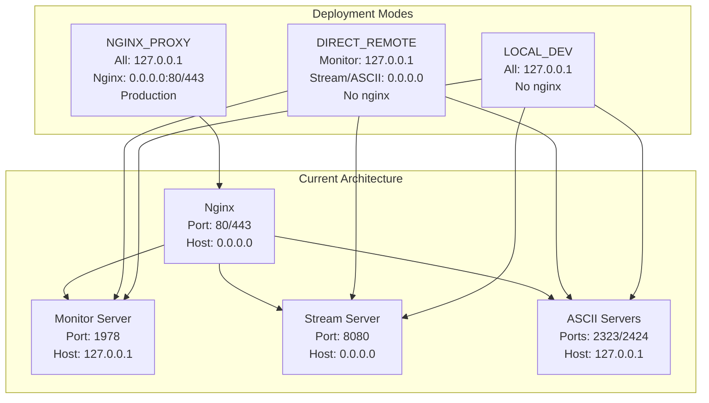

# Server-Side Code Review & Best Practices

## Current Issues Identified

### 1. **Host Binding Inconsistency** 🔴 Critical

**Problem**: Host binding is scattered and inconsistent:
- Monitor server: `127.0.0.1` (localhost only) ✅ Good for security
- Stream server: `0.0.0.0` (all interfaces) ✅ Good for public access
- ASCII servers: `127.0.0.1` by default, but configurable
- **Issue**: No clear pattern for "nginx mode" vs "direct access mode"

**Impact**: 
- With nginx: All servers should bind to `127.0.0.1` (nginx handles public)
- Without nginx: Some servers need `0.0.0.0` for remote access
- Currently requires manual config changes to switch modes

### 2. **Nginx Configuration Hardcoding** 🟡 Medium

**Problem**: `setup_nginx.sh` has hardcoded ports:
```bash
proxy_pass http://127.0.0.1:8080;  # Hardcoded
proxy_pass http://127.0.0.1:1978/; # Hardcoded
```

**Impact**: 
- Can't change ports after nginx setup without editing script
- No way to generate nginx config from current `server_config.py`
- Port changes require manual nginx config updates

### 3. **Missing Deployment Mode Detection** 🟡 Medium

**Problem**: No way to detect:
- Are we behind nginx? (should bind to 127.0.0.1)
- Are we direct access? (may need 0.0.0.0)
- Local dev vs remote production?

**Impact**: Manual configuration required for each deployment scenario

### 4. **Configuration Scattered** 🟡 Medium

**Problem**: Host configuration in multiple places:
- `web_service.py`: `WEB_HOST`, `STREAM_HOST`
- `ascii_server.py`: `ASCII_HOST`
- `ascii_web_server.py`: `ASCII_HOST`
- `server_constants.py`: `STREAM_HOST`
- `ascii_constants.py`: `ASCII_HOST`

**Impact**: Hard to maintain consistent configuration

### 5. **No Environment Variable Support** 🟢 Low Priority

**Problem**: Can't override config via environment variables (standard practice for containers/cloud)

**Impact**: Less flexible for deployment automation

## Best Practices Recommendations

### Architecture Pattern: "Deployment Mode" Concept



### Current vs Proposed Architecture

**Current (Scattered Config):**
```
web_service.py      → WEB_HOST, STREAM_HOST
ascii_server.py     → ASCII_HOST  
ascii_web_server.py → ASCII_HOST
server_constants.py → STREAM_HOST
ascii_constants.py  → ASCII_HOST
```

**Proposed (Centralized):**
```
server_config.py → HostConfig (single source of truth)
  ↓
All servers use: get_config().get_hosts()
```

### Recommended Solution Structure

1. **Extend `server_config.py`** with:
   - Host configuration (centralized)
   - Deployment mode detection
   - Environment variable support

2. **Add `HostConfig` dataclass**:
   ```python
   @dataclass
   class HostConfig:
       monitor: str      # "127.0.0.1" or "0.0.0.0"
       stream: str       # "127.0.0.1" or "0.0.0.0"
       ascii_telnet: str # "127.0.0.1" or "0.0.0.0"
       ascii_websocket: str
   ```

3. **Deployment Modes**:
   - `DEPLOYMENT_LOCAL_DEV` - Everything localhost
   - `DEPLOYMENT_DIRECT_REMOTE` - Public access, no nginx
   - `DEPLOYMENT_NGINX_PROXY` - Behind nginx (production)

4. **Nginx Config Generator**:
   - Function to generate nginx config from current `server_config.py`
   - Makes port changes easy even after nginx setup

## Security Considerations

### Current State ✅ Good
- Monitor server defaults to `127.0.0.1` (sensitive data protected)
- Stream server can be public (intended for public viewing)

### Recommendations
1. **Monitor should ALWAYS be localhost** when behind nginx
2. **Stream can be public** - that's its purpose
3. **ASCII servers**: 
   - Localhost if behind nginx
   - Public if direct access needed
4. **Add authentication** for monitor endpoints (future enhancement)

## Implementation Priority

### Phase 1: Critical Fixes (Do Now)
1. ✅ Centralize host configuration in `server_config.py`
2. ✅ Add deployment mode detection
3. ✅ Make host binding consistent across all servers

### Phase 2: Nginx Integration (Next)
1. Add nginx config generator function
2. Update `setup_nginx.sh` to use generated config
3. Add command-line flag: `--nginx-config` to output config

### Phase 3: Environment Variables (Nice to Have)
1. Support `DEPLOYMENT_MODE` env var
2. Support `USE_NGINX=true/false` env var
3. Support port overrides via env vars

## Additional Findings

### 6. **Server Lifecycle Management** 🟢 Good
- ✅ `daemon_threads = True` - Threads exit cleanly with main process
- ✅ `allow_reuse_address = True` - Prevents "Address already in use" errors
- ⚠️ `serve_forever()` blocks - No graceful shutdown (but acceptable for daemon threads)

### 7. **Error Handling** 🟢 Good
- ✅ Network errors caught appropriately (ConnectionResetError, BrokenPipeError)
- ✅ Timeouts configured (5s for monitor, 15s for stream)
- ✅ Stall detection for stream connections
- ✅ Silent handling of normal disconnects (reduces log noise)

### 8. **Resource Management** 🟢 Good
- ✅ Semaphores for connection limiting
- ✅ Proper cleanup in finally blocks
- ✅ Heartbeat tracking for client management

### 9. **Security Hardening** 🟢 Good
- ✅ Path traversal protection in `_serve_static_file()`
- ✅ Static file serving restricted to `static/` directory
- ✅ Monitor server defaults to localhost (good for sensitive data)

## Questions for You

1. **Do you always use nginx in production?**
   - If yes: We can default to nginx mode
   - If no: We need flexible host binding

2. **Do you need remote monitor access?**
   - If yes: Need authentication or VPN
   - If no: Keep localhost-only (current default is good)

3. **Port change frequency?**
   - If often: Nginx config generator is critical
   - If rare: Current approach might be fine

4. **Deployment environments?**
   - Local dev machine?
   - Remote VPS/server?
   - Docker containers?
   - Cloud (AWS/GCP/Azure)?

5. **Do you need graceful shutdown?**
   - Current: Servers stop when main process exits (works fine)
   - Alternative: Signal handlers for clean shutdown (usually not needed)

## Proposed Code Changes

I can implement:
1. **HostConfig** in `server_config.py`
2. **Deployment mode detection** (env var or setting)
3. **Centralized host binding** logic
4. **Nginx config generator** function
5. **Update all servers** to use centralized host config

This would make it:
- ✅ Easy to switch between local/remote/nginx modes
- ✅ Easy to change ports even with nginx configured
- ✅ Follow deployment best practices
- ✅ More secure by default
- ✅ More maintainable

Would you like me to implement these improvements?

